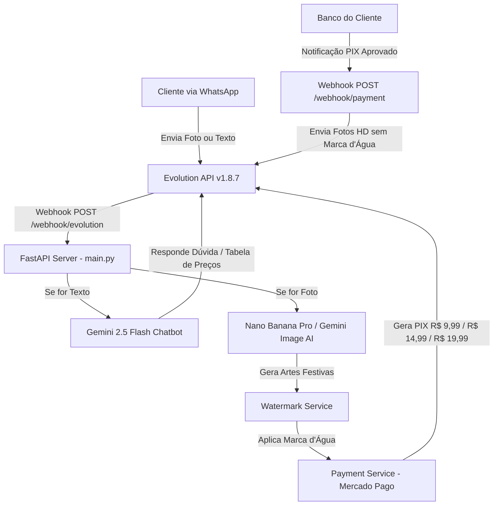

# 🎂 Auto-Aniversário AI — WhatsApp, Gemini AI & Pagamentos PIX

> **Auto-Aniversário AI** é um sistema completo e automatizado de atendimento via WhatsApp para comemorações de aniversário. O cliente envia uma foto de perfil pelo WhatsApp, a Inteligência Artificial gera artes festivas de altíssima definição (HD), o sistema envia uma **prévia com marca d'água + códigos PIX copia e cola**, e assim que o pagamento é confirmado, a imagem em alta definição sem marca d'água é entregue automaticamente!

---

## 🏗️ Arquitetura e Modelos de IA

| Funcionalidade | Tecnologia / Modelo | Descrição |
| :--- | :--- | :--- |
| **Atendimento via WhatsApp** | `evoapicloud/evolution-api:v1.8.7` | Instância Docker Baileys conectada via QR Code no número `+55 12 98319-0845` (*Fotos Zap Arya*). |
| **Chatbot Inteligente de Texto** | **Google Gemini 2.5 Flash** (`gemini-2.5-flash`) | Responde dúvidas dos clientes no WhatsApp sobre pacotes, valores e funcionamento de forma rápida e amigável. |
| **Geração de Fotos IA** | **Nano Banana Pro** (`nano-banana-pro-preview`) | Modelo especializado da Google para geração de retratos de aniversário e temas festivos em alta definição (8K). *(Requer ativação do plano Pay-as-you-go no Google AI Studio)*. |
| **Proteção de Prévia** | Pillow (PIL) | Aplica marcas d'água sobre a imagem gerada para envio prévio ao pagamento. |
| **Cobrança Automática** | Mercado Pago API | Gera cobrança PIX com webhook para liberação instantânea da imagem em HD. |



---

## 📂 Estrutura de Arquivos

```
projeto-aniversarios-ai/
├── main.py                  # Servidor FastAPI com Webhooks (/webhook/evolution e /webhook/payment)
├── config.py                # Configurações globais e leitura do .env com override=True
├── prompts.py               # 👈 PROMPTS (Goku Super Saiyajin, Estúdio Luxo 8K, Neon) e textos de PIX
├── gemini_service.py        # Integração com Gemini 2.5 Flash (Chat) e Nano Banana Pro (Imagens)
├── watermark_service.py     # Aplicação de marca d'água de proteção sobre as prévias
├── payment_service.py       # Gerador de PIX (Mercado Pago / Simulação) e validação de pagamento
├── whatsapp_service.py      # Funções de envio de texto, mídia e download de fotos da Evolution API v1.8.7
├── docker-compose.yml       # Orquestrador Docker da Evolution API v1.8.7 (Porta 8080)
├── test_gemini.py           # Script de teste de geração com IA
├── .env                     # Variáveis de ambiente secretas (GEMINI_API_KEY, EVOLUTION_API_KEY, etc)
└── README.md                # 👈 Documentação Oficial do Projeto
```

---

## ⚙️ Variáveis de Ambiente (`.env`)

```env
# Google Gemini AI Key
GEMINI_API_KEY=SUA_CHAVE_GEMINI_AQUI

# Evolution API (WhatsApp Local)
EVOLUTION_API_URL=http://localhost:8080
EVOLUTION_API_KEY=minha_chave_secret_123
EVOLUTION_INSTANCE=aniversario_ai

# Mercado Pago PIX (Opcional - opera em modo simulação se vazio)
MERCADOPAGO_ACCESS_TOKEN=SEU_TOKEN_MERCADO_PAGO
PIX_VALOR_PADRAO=9.99

# Servidor Python
PORT=8005
HOST=0.0.0.0
```

---

## 🚀 Como Rodar e Testar o Projeto

### 1. Iniciar a Evolution API (Docker)
```bash
cd /home/mopa/projeto-aniversarios-ai
docker compose up -d
```

### 2. Iniciar o Servidor FastAPI Backend
```bash
cd /home/mopa/projeto-aniversarios-ai
.venv/bin/python main.py
```

### 3. Expor a porta 8005 para Webhooks (Se necessário)
```bash
ssh -R 80:localhost:8005 serveo.net
```

---

## 📌 Próximos Passos ao Retomar o Projeto

1. **Ativar o Faturamento Pay-As-You-Go no Google AI Studio:**
   - Acesse `aistudio.google.com`.
   - Selecione a chave de API e ative a fatura para liberar as cotas do modelo **`nano-banana-pro-preview`** (`gemini-3-pro-image`).
2. **Carregar Modelos / Pacotes de Fotos Personalizados:**
   - Adicionar ou ajustar novos prompts em `prompts.py` conforme seus modelos de pacotes preferidos.
3. **Conectar o Access Token do Mercado Pago:**
   - Inserir o `MERCADOPAGO_ACCESS_TOKEN` em `.env` para produção real.
